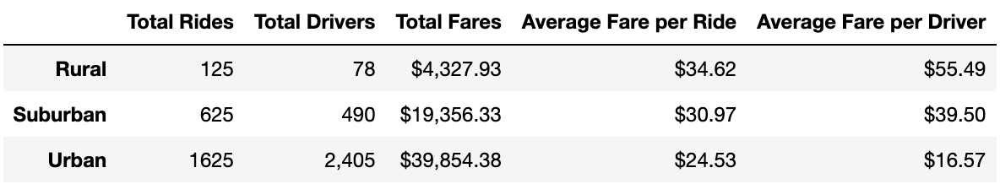
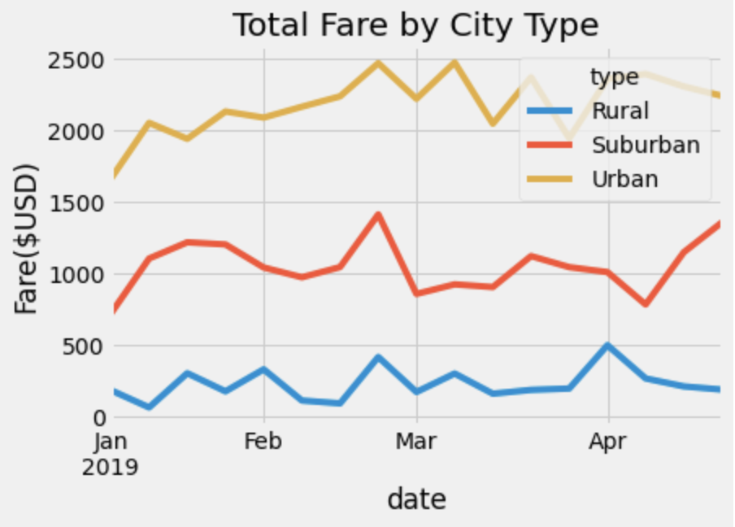

# PyBer_Analysis

# Project Overview:

* An analysis of ride-sharing data among different cities types using Python (3.7.11), Anaconda, Jupyter notebooks, Pandas, and Matplotlib.

## Resources:

* Data Sources: city_data.csv and ride_data.csv
* Software: Python 3.7.11, Anaconda, Jupyter Notebooks, Pandas, Matplotlib

# Ride Sharing Results:

- Deliverable 1: The summary results (as shown below) demonstrate that Urban cities have a greater number of total rides, drivers, and total fares as compared to Suburban and Rural cities.  Most interestingly, however, it was shown that rural cities generated a higher average fare per ride ($34.62) and higher average fare per driver ($55.49) as compared to both Suburban and Urban cities.  Focusing on the average fare per driver, it can be observed that rural drivers generate an average fare rate that is 235% higher ($55.49) than that of Urban drivers ($16.57). 

* Summary Results

- Deliverable 2: The multi-line plot (as shown below) demononstrates the monthly Total fare ($USD) versus city type.  Overall, Urban cities generate the highest proportion of total fare as compared to Suburban and Rural cities.  

* Summary Multi-plot Results:

# Summary:

Based upon the results, the following business recommendations can be suggested:

1. High-quality service to customers in Urban cities must continue as they account for the majority (62%) of monthly total fares at $39,854.38. Urban cities with similar socio-economic demographics should be evaluated for future growth and expansion. 

2. In order to maintain employee retention, drivers in Urban cities may require supplemental hourly stipend to subsidize the lower average fare per drivers as compared to Suburban and Rural city drivers. 

3. Total miles driven per day should be evaluated to determine an average pay rate per mile as many Urban drivers likely travel less as compared to Suburban and Rural drivers.  The average pay rate per mile may help eliminate the disparity within the average fare per driver category. 

